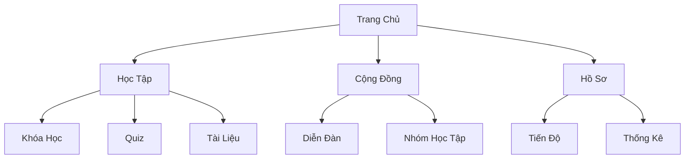
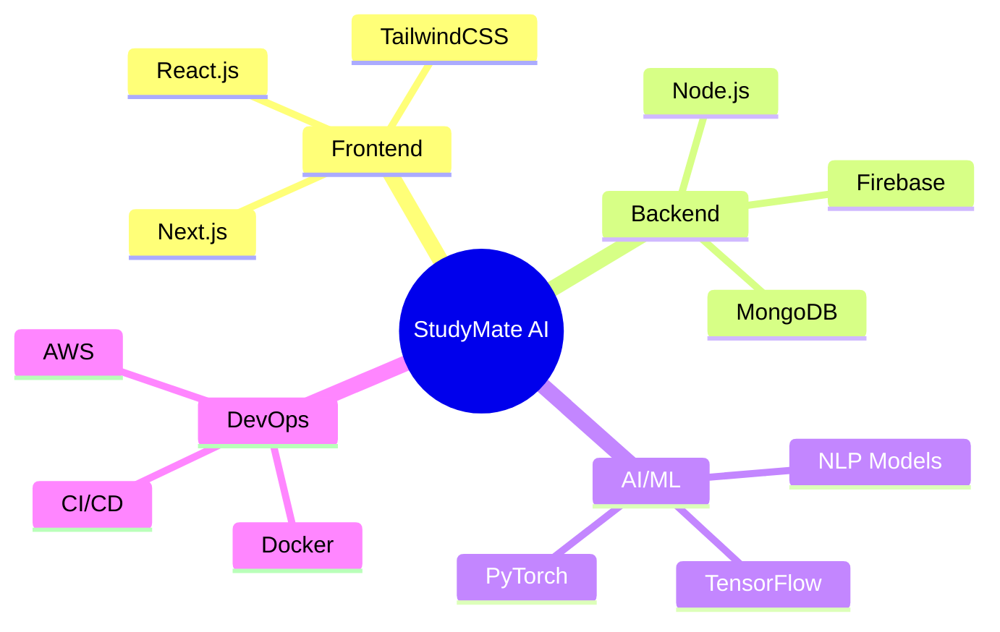
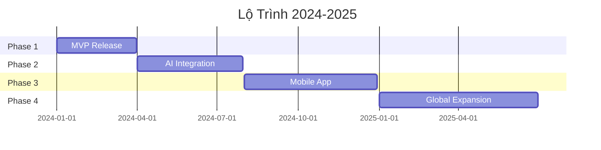

<div align="center">
  
)

# ✨ StudyMate AI - Nền Tảng Học Tập Thông Minh ✨

[](https://github.com/nguyenngoctufpt/StudyMate-AI_Rising-Dragon-Tech_Project)
[](https://github.com/nguyenngoctufpt)
[](LICENSE)

</div>

<p align="center">
  <a href="#🌟-tính-năng">Tính Năng</a> •
  <a href="#🚀-bắt-đầu">Bắt Đầu</a> •
  <a href="#📖-hướng-dẫn">Hướng Dẫn</a> •
  <a href="#👥-đội-ngũ">Đội Ngũ</a> •
  <a href="#📞-liên-hệ">Liên Hệ</a>
</p>

<div align="center">

)

</div>

## 🎯 Tầm Nhìn

> *"Đổi mới giáo dục Việt Nam thông qua công nghệ AI - Mang đến trải nghiệm học tập cá nhân hóa cho mọi sinh viên"*

## 🌟 Tính Năng

<div align="center">

| 🤖 AI Assistant | 📚 Học Tập | 🎯 Mục Tiêu | 🌟 Cộng Đồng |
|:--------------:|:----------:|:-----------:|:------------:|
| Trợ lý AI 24/7 | Quiz thông minh | Lộ trình cá nhân | Kết nối học tập |
| Gợi ý cá nhân hóa | Video bài giảng | Theo dõi tiến độ | Chia sẻ kiến thức |
| Hỗ trợ đa ngôn ngữ | Tài liệu đa dạng | Báo cáo chi tiết | Thảo luận nhóm |

</div>

## 🎨 Giao Diện

<div align="center">



</div>

## 🚀 Bắt Đầu

```bash
# 1. Clone dự án
git clone https://github.com/nguyenngoctufpt/StudyMate-AI_Rising-Dragon-Tech_Project.git

# 2. Cài đặt dependencies
cd StudyMate-AI_Rising-Dragon-Tech_Project
npm install

# 3. Khởi chạy
npm start
```

## 📊 Thống Kê Ấn Tượng

<div align="center">

| 📈 Chỉ Số | 🎯 Mục Tiêu 2025 | ✨ Đạt Được |
|:---------:|:---------------:|:-----------:|
| Người Dùng | 50,000+ | 12,000+ |
| Khóa Học | 1,000+ | 500+ |
| Đánh Giá | 4.9/5 ⭐ | 4.8/5 ⭐ |
| Cộng Đồng | 100+ nhóm | 50+ nhóm |

</div>

## 💫 Công Nghệ Sử Dụng

<div align="center">



</div>

## 👥 Đội Ngũ Phát Triển

<div align="center">
<table>
  <tr>
    <td align="center">
      <a href="https://github.com/nguyenngoctufpt">
        
        <br />
        <sub><b>Nguyễn Ngọc Tú</b></sub>
      </a>
      <br />
      <small>Founder & Lead Developer</small>
    </td>
    <!-- Thêm thành viên khác tại đây -->
  </tr>
</table>
</div>

## 🌟 Điểm Nổi Bật

- 🤖 **AI Thông Minh**
  - Gợi ý học tập cá nhân hóa
  - Hỗ trợ 24/7 với chatbot AI
  - Phân tích dữ liệu học tập

- 📚 **Nội Dung Phong Phú**
  - 500+ khóa học chất lượng cao
  - Video bài giảng HD
  - Tài liệu đa dạng

- 🎯 **Theo Dõi Tiến Độ**
  - Dashboard trực quan
  - Báo cáo chi tiết
  - Đề xuất cải thiện

## 📞 Liên Hệ & Hỗ Trợ

<div align="center">

| 📧 Email | 🌐 Website | 💬 Discord |
|:--------:|:---------:|:----------:|
| support@studymate-ai.vn | studymate-ai.vn | StudyMate Community |

</div>

## 📅 Lộ Trình Phát Triển



## 📄 Giấy Phép

Copyright © 2024-2025 Rising Dragon Tech. All rights reserved.

---

<div align="center">

*Made with ❤️ by Rising Dragon Tech*

**[⬆ Về đầu trang](#studymate-ai---nền-tảng-học-tập-thông-minh)**

</div>
